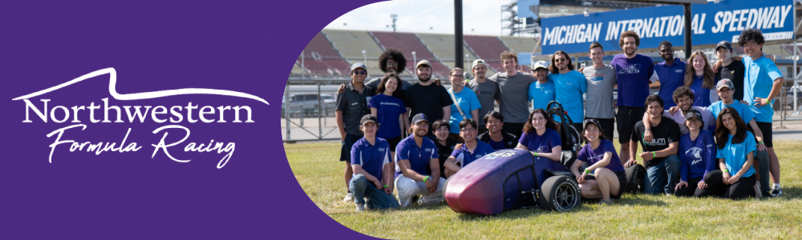

<h1> 🏎️ Northwestern Formula Racing (NFR) 🏎️ </h1>

Our team of more than 60 undergraduate and graduate students come from diverse backgrounds and studies across our McCormick School of Engineering as well as the broader Northwestern community.

The design and construction of our car is an aggressive practicum, allowing students to take their coursework into application and sharpen their skills. Our work routinely runs ahead of classes, encouraging freshmen to acquire knowledge of material covered in senior-level coursework, while offering upperclassmen the opportunity to mentor and engage team members.

### 🥇 Highlighted Repositories 🥇
These are some of the repositories that we are most proud of:
* [Our CAN Library](https://github.com/NU-Formula-Racing/CAN), which powers the communication between all of our car's electrical systems.
* [DAQSER](https://github.com/NU-Formula-Racing/daq-serializer-24), which powers the seraialization of data from our car's sensors in our data acquisition system for NFR24.
* [Our Timer Library](https://github.com/NU-Formula-Racing/timers), a very simple, yet powerful, timer library that we use to time our car's systems.

### 🥳 How to Get Involved 🥳
We are always looking for new members to join our team! If you are a Northwestern student, follow us on [Instagram](https://www.instagram.com/nufsae/) to stay up to date with our events and meetings.

### 📧 Contact Us 📧
Get in touch with us via our [website](https://northwesternformularacing.com/contact/)! We'd love to hear from you.
